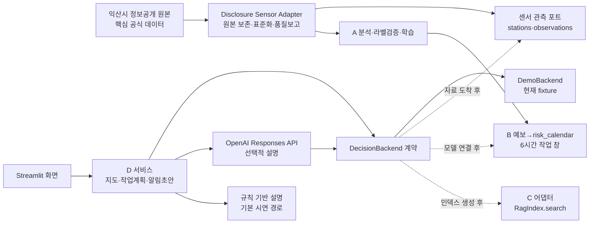

# D 파트 공모전 시연용 프로토타입 설계

> 상태: 회의용 구조 초안 · 2026-08-12
> 전제: 익산시 정보공개청구 자료 도착 전 · Streamlit 사용 확정

## 1. 이번 단계의 결론

D는 새로운 예측 모델을 만드는 파트가 아니다. **익산시 공식 센서 관측과 A/B/C의
결과를 안전하게 연결해 농장주가 작업 시점을 판단하도록 보여주는 서비스 계층**이다.

정보공개청구 자료는 이 프로젝트의 핵심 공식 데이터셋이다. 화면 캡처를 기준으로
측정소별 위치·시각과 황화수소·암모니아·TVOC·복합악취 원값·온습도·풍향·풍속
시계열을 기대한다. 실제 열 이름과 단위는 원자료와 코드북을 받은 뒤 확정한다.

- 공통/A 데이터 계층: 정보공개 원본을 보존하고 표준 센서 스키마·품질보고서로 변환한다.
- A: 공식 센서 자료를 분석·라벨 검증에 활용하고 민원 위험 모델과 등급 기준을 만든다.
- B: 예보를 모델에 넣어 위험 캘린더와 6시간 작업 창 순위를 계산한다.
- C: 법령·매뉴얼의 근거 청크와 출처를 검색한다.
- D: 공식 센서 관측 지도와 미래 위험 결과를 분리해 보여주고, 출처·한계를 보존해
  설명하며 알림 초안의 사람 승인을 받는다.

따라서 LLM은 위험 점수나 시간 순위를 계산하지 않는다. 결정론적 코드가 확정한
결과를 바꾸지 않고 설명만 한다. 공식 데이터가 도착해도 Streamlit 화면과 D 계약은
유지하고 `D_BACKEND_FACTORY`가 만드는 provider만 실연결 어댑터로 교체한다.

**현재/과거 센서 관측과 미래 민원 위험 예측은 서로 다른 데이터 계층이다.** 센서
농도를 미래 민원 확률로 표시하거나, 미래에 알 수 없는 동시점 센서값을 7일 예측의
입력으로 사용하지 않는다.

## 2. 범위

### 이번 회의 버전에 포함

1. 고정 측정소 fixture 기반 익산 센서 지도와 관측 상세 카드
2. 고정 fixture 기반 7일 민원 위험 캘린더
3. 6시간 작업 창 추천 Top 3 / 회피 Top 3
4. 법령·매뉴얼 근거 카드의 반환 형태
5. 플룸 참고 정보와 주민 알림 초안
6. 농장주 승인 기록(세션 안에서만, 외부 발송 없음)
7. 선택적 OpenAI Responses API 설명과 규칙 기반 fallback
8. 데이터 상태·관측시각·출처·갱신시각·한계 표시

### 이번 단계에서 제외

- 실제 정보공개 원본의 컬럼 매핑·정제, 모델 학습, 성능 재검증
- 실제 KMA·B DB·C 인덱스 연결
- 실제 주민 연락처, 실제 문자 발송
- 사용자 인증, 다농장 운영, 운영 배포
- 플룸을 민원 위험 등급이나 추천 점수에 반영
- 익산 외 지역에 대한 성능 또는 즉시 적용 주장

## 3. 사용자 시연 흐름

1. 상단의 `공식 데이터 대기 / FIXTURE / 알림 초안만` 상태를 확인한다.
2. 지도에서 측정소 위치와 현재 관측 상세를 확인한다. 지금은 가상 값임을 설명한다.
3. D+1~3의 3시간 블록과 D+4~7의 일 단위 캘린더를 비교한다.
4. 작업 유형과 저장 경과일을 선택해 6시간 추천 Top 3와 회피 Top 3를 만든다.
5. 추천 사유와 C의 문서명·단원·쪽수·근거 문장을 확인한다.
6. 추천 창을 하나 선택하고 플룸 영향 후보를 **미검증 참고 정보**로 본다.
7. 주민 알림 문구를 편집하고 농장주 승인만 기록한다. 실제 발송은 없다.

이 흐름은 `현재 무엇이 관측되는지(공식 센서) → 앞으로 언제 위험한지(B) → 왜 그런지(C)
→ 어떻게 행동할지(D) → 사람 승인`을 3~5분 안에 보여주는 데 초점을 둔다.

## 4. 구조



핵심 규칙은 `Streamlit → D 서비스 → 포트 → fixture/실연결 어댑터`의 한 방향이다.
Streamlit이 SQLite, `RagIndex`, KMA, legacy 모듈을 직접 호출하지 않는다.

### 현재 파일

```text
demo/
├── app/
│   ├── dashboard.py       # Streamlit 진입점
│   ├── contracts.py       # SensorObservation, GuideCard, WorkWindow, NotificationDraft
│   ├── backend.py         # 센서/B/C 포트, strict OpenAI 도구 6종, dispatcher
│   ├── backend_factory.py # 환경설정으로 fixture/실연결 provider 주입
│   ├── demo_backend.py    # 난수 없는 fixture provider
│   ├── guide_service.py   # 결정론적 6시간 창·알림 초안
│   └── openai_guide.py    # 선택적 Responses API 도구 호출 루프
├── docs/D_PROTOTYPE_PLAN.md
├── tests/test_d_scaffold.py
└── requirements-d.txt
```

기존 `agents/work_guide.py`, `agents/tools_schema.py`, `agents/notify_draft.py`는 검증
이력 보존용이다. 새 Streamlit 경로에서는 직접 사용하지 않는다.

## 5. 데이터 상태 정책

화면과 도구 결과는 다음 상태 중 하나를 명시한다.

| 상태 | 의미 | 화면 동작 |
| --- | --- | --- |
| `fixture` | 고정 시연 자료 | 시연 자료 배지와 한계를 항상 표시 |
| `connected` | 공식 센서/B/C 실연결 결과 | 출처·버전·기준시각 표시 |
| `stale` | 마지막 정상 결과이나 갱신 지연 | 경고와 마지막 갱신시각 표시 |
| `unavailable` | 결과를 만들 근거가 없음 | fixture로 몰래 전환하지 않고 제공 불가 표시 |

`OPENAI_API_KEY` 유무는 데이터 모드를 결정하지 않는다. API 키가 있어도 fixture는
fixture이며, 실연결 실패를 자동으로 fixture 결과처럼 보여주지 않는다.

기존 자료의 공모전 사용 권한은 확보된 것으로 확정한다. 다만 공식 정보공개 자료가
아직 도착하지 않았으므로 fixture나 기존 자료를 `정보공개 원자료로 검증됨`이라고
표시하지 않는다. 데이터 출처와 버전은 각각 분리해 남긴다.

## 6. 공식 센서/A/B/C 연결 계약

### 익산시 정보공개 원본 → 표준 센서 계층 → D

원본 파일은 수정하지 않고 보존한다. 실제 자료가 도착하면 어댑터 하나가 다음 산출물을
만드는 구조를 채택한다.

```text
raw/익산시_정보공개_원본.*
→ sensor_stations.parquet
→ sensor_observations.parquet
→ sensor_quality_report.json
```

지도용 `get_sensor_snapshot(at=None)`은 다음 canonical 필드를 평탄화해 반환한다.

| 구분 | 필드 |
| --- | --- |
| 식별·위치 | `station_id`, `station_number`, `station_name`, `station_type`, `latitude`, `longitude`, `coord_quality` |
| 시간·추적 | `observation_id`, `observed_at`, `ingested_at`, `source_row_id`, `data_version` |
| 악취 관측 | `h2s_ppm`, `nh3_ppm`, `tvoc_ppm`, `complex_odor_value`, `complex_odor_unit` |
| 기상 관측 | `temperature_c`, `humidity_pct`, `wind_direction_text`, `wind_direction_degree`, `wind_speed_ms` |
| 품질 | `status_label`, `record_qc`, `quality_flags` |

복합악취 화면 값의 의미와 단위는 코드북 확인 전까지 원값으로만 보존한다. 좌표는
nullable로 두고, 없으면 해당 관측을 상세·품질 표에는 유지하되 지도에서만 제외한다.
화면 픽셀로 좌표를 역추정하지 않고 공식 측정소 기준정보를 요청한다. `0`, 빈칸,
검출한계 미만, 통신오류를 같은 값으로 처리하지 않는다. 과거 조회가 필요하면 같은
계약에 `get_sensor_timeseries(station_id, variables, start, end)`를 추가한다.

각 provider는 `get_system_status()`에 `default_farm_id`, 데이터 모드, 공식 자료 상태,
컴포넌트별 상태를 반환한다. 대시보드는 이를 이용해 농가명과 FIXTURE/연결/지연 배지를
동적으로 그린다. `D_BACKEND_FACTORY=package.module:create_backend`를 설정하면
dashboard 코드를 고치지 않고 실연결 provider를 주입할 수 있다. factory 로딩 실패를
fixture로 자동 대체하지 않아 공식 자료와 시연값이 섞이는 것을 막는다.

센서 관측은 지도와 분석·라벨 검증에 쓰되 7일 미래 예측의 동시점 입력으로 사용하지
않는다. 농도를 모델에 쓰려면 `기상예보→농도예측→민원위험` 2단계 구조나 별도
nowcast로 정의하고 시간 분할 검증을 거쳐야 한다.

### A → B

D가 A 모델 파일을 직접 읽지 않는다. D의 임시 계약은 3시간 상대 민원 위험
full/reduced 구조로 고정하며, 실제 A 산출물 차이는 B 어댑터가 흡수한다.

```text
model_full / model_reduced
feature_schema + units
target_type (binary/multiclass)
grade_thresholds + calibration
model_version + trained_data_version
```

### B → D

`get_risk_calendar(farm_id, days, work_type)`의 최소 항목:

```json
{
  "date": "YYYY-MM-DD",
  "block": 0,
  "start": "ISO-8601",
  "resolution": "3h",
  "risk_score": 0.23,
  "risk_grade": "주의",
  "horizon": "D+1~3",
  "model_type": "full",
  "model_version": "...",
  "forecast_issued_at": "...",
  "updated_at": "..."
}
```

D+4~7은 반드시 `block=null`, `start=null`, `resolution=day`로 전달한다. 중기예보를
3시간 블록으로 복제하지 않는다. 최종 연결에서는 B가 공개 함수
`rank_work_windows(farm_id, work_type, days)`를 제공하고, D가 DB 내부 계산을
중복하지 않는 구조를 채택한다. 현재 D의 계산은 fixture 화면 검증에만 사용한다.

### C → D

현재 C의 공개 경계는 다음이다.

```python
RagIndex.search(question, query_type, k=3, boost=True)
```

D는 `refused`, `notice`, `doc`, `unit`, `page`, `page_end`, `hier`, `snippet`을
버리지 않는다. `score`는 검색 유사도이지 답변 신뢰확률이 아니다. 근거가 없거나
인덱스가 없으면 답을 만들지 않고 `insufficient_evidence` 또는 `unavailable`로 표시한다.

## 7. OpenAI 연결 원칙

런타임 표현은 `Codex API`가 아니라 **OpenAI Responses API 기반 설명 생성**이
정확하다. 모델명은 코드에 고정하지 않고 `OPENAI_MODEL` 환경변수로 팀이 선택한다.

도구 호출 흐름:

1. 결정론적 서비스가 추천·회피 창을 먼저 확정한다.
2. 앱이 모델에 확정 계획과 strict 도구 6종을 제공한다.
3. 모델의 `function_call`을 허용목록 dispatcher가 실행한다.
4. 같은 `call_id`의 `function_call_output`을 모델에 돌려준다.
5. 도구 호출이 끝나면 모델은 정해진 카드 형식으로 설명한다.
6. 실패하거나 키가 없으면 동일 계획을 규칙 기반 문장으로 표시한다.

도구 스키마는 `strict=true`, 모든 객체의 `additionalProperties=false`, 모든 속성의
`required` 포함 규칙을 지킨다. 구현 근거는
[OpenAI Function calling 공식 문서](https://developers.openai.com/api/docs/guides/function-calling)다.

## 8. 신뢰성과 표현 규칙

- `악취 위험도` 대신 **민원 위험도**
- `민원을 줄인다` 대신 **상대적으로 위험한 시간대 회피를 지원**
- fixture를 `실데이터`, `실제 예측`, `익산 6년 실측`으로 표현 금지
- 센서 지도는 현재/과거 관측, 캘린더는 미래 민원 위험 예측으로 분리
- 센서 농도·복합악취 원값을 민원 확률이나 법정 위험등급으로 변환 금지
- 관측시각·수집시각·예보발표시각·예측유효시각을 서로 다른 필드로 유지
- D+4~7을 시간대 추천에 사용 금지
- 작업 가중치와 저장 14일 이후 1.5배는 잠정 가정값 `[C]`
- 플룸은 `미검증 참고·등급 미반영` 고정 표시
- RAG 검색 점수를 신뢰도 백분율로 표시 금지
- 개별 법률 판단은 거절하고 법률구조공단 132/관할 기관 안내
- 주민 알림은 초안과 승인 기록만, 실제 발송 금지
- 농가 입력뿐 아니라 데이터 버전·모델 버전·예보 발표시각이 바뀌면 기존 추천과
  알림 초안을 무효화하고 다시 생성

## 9. 공식 데이터 도착 후 적용 순서

1. 원본을 그대로 보존하고 파일 형식·전체 기간·좌표·시간대·단위·품질코드를 확인한다.
2. 공식 컬럼을 `sensor-observation-v1`로 매핑하고 품질 보고서를 만든다.
3. D의 센서 fixture provider를 공식 센서 adapter로 교체해 지도와 상세 카드를 확인한다.
4. A가 센서 자료의 분석·라벨 검증·모델 실험을 수행하고 버전을 부여한다.
5. B가 채택 모델·예보로 `risk_calendar`와 작업 창을 만들고 버전·상태를 제공한다.
6. D의 위험 fixture를 B adapter로, RAG fixture를 C adapter로 교체한다.
7. 화면의 fixture 배지를 connected/verified 상태로 바꾸되 성능 수치는 검증 보고서와
   데이터 버전이 일치할 때만 노출한다.

익산 외 확장은 “같은 계약을 따르는 지역별 민원·기상·농가·조례 어댑터를 추가할 수
있다”는 구조적 가능성까지만 언급한다. 실제 적용에는 지역별 재학습·재검증이 필요하다.

## 10. 단계별 완료 기준

### P0 — 이번 회의

- D 책임 경계·사용자 흐름·데이터 계약 합의
- canonical 센서 계약과 가상 측정소 지도 표시
- 인터넷/API 키 없이 고정 시나리오가 재현
- 모든 fixture·미검증·미발송 상태가 보임

### P1 — 팀 코드 연결

- B의 최신 7일 캘린더/상태 어댑터
- C `RagIndex` 어댑터 및 인덱스 준비
- OpenAI 선택 연결과 오류 상태 확인
- 동일 fixture를 장애 대비 시연 스냅샷으로 유지

### P2 — 공식 데이터 도착 후

- A 재학습·검증 결과와 모델/데이터 버전 연결
- 공식 센서 adapter·품질보고서와 지도 연결
- B의 stale/error/mock 금지 정책 반영
- 발표 문구와 성능 카드 갱신

### P3 — 출품 안정화

- 3~5분 시연 리허설과 화면 고정
- 공개 제출 전 API 키 제거·폐기 및 Git 이력 점검
- 데이터 사용 권한과 출처 증빙 확인

## 11. 확정된 결정과 자료 도착 후 확인사항

### 확정

1. 정보공개청구 자료는 프로젝트의 핵심 공식 데이터셋이다.
2. 측정소별 악취·기상 시계열과 위치정보를 기대하며 fixture sensor provider를 교체한다.
3. 기존 자료의 공모전 사용 권한은 확보됐다.
4. 지도는 P0 시연 범위에 포함한다.
5. D의 A/B 경계는 3시간 상대 민원 위험 full/reduced + `rank_work_windows`로 둔다.
6. 규칙 기반 경로를 기본으로 하고 OpenAI Responses API 설명은 선택 기능으로 둔다.
7. 익산 외 확장은 adapter 가능성만 언급하고 지역별 재학습·재검증을 전제로 한다.

### 실제 파일을 받으면 확인

1. 최신 스냅샷뿐 아니라 학습·검증 가능한 과거 시계열 전체가 포함되는가
2. 파일 형식, 전체 기간, 측정 주기, 시간대가 무엇인가
3. 공식 측정소 ID·좌표·좌표계와 이전·명칭 변경 이력이 포함되는가
4. 변수별 공식 단위, 복합악취 값의 산출 방식, 검출한계가 무엇인가
5. 결측·통신오류·점검·품질코드가 어떻게 표현되는가
6. 민원 발생시각/집계가 함께 오는가, 기존 민원 자료와 시간·공간 조인이 가능한가
7. 원본 위치정보 공개 범위에 별도 제한이 있는가
